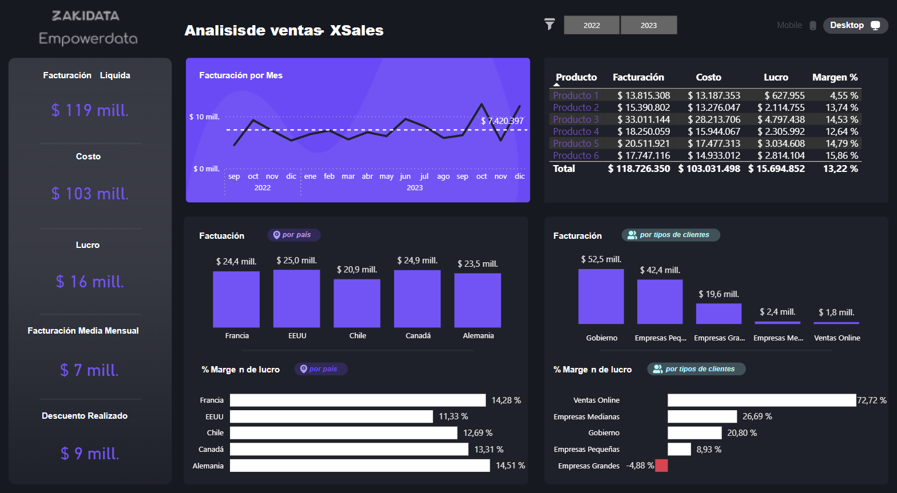
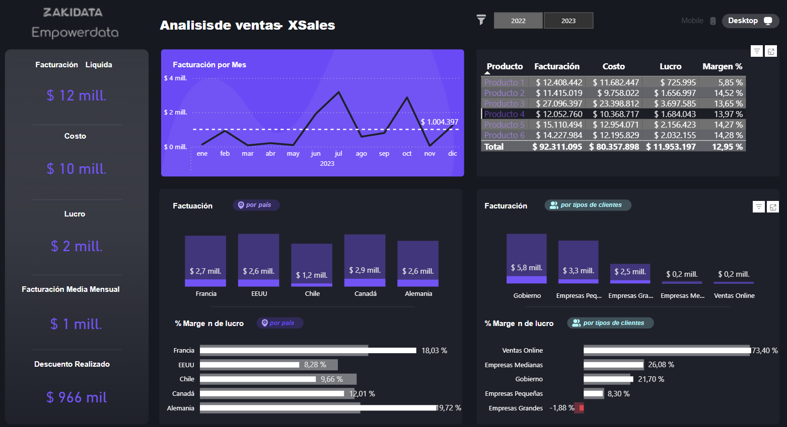

# 📊 Xsales - Dashboard de Ventas en Power BI

Este proyecto consiste en el análisis de ventas de una empresa ficticia llamada **Xsales**, utilizando Power BI para construir un dashboard interactivo con los principales indicadores comerciales.

---

## 📌 Descripción del proyecto

Se desarrolló un informe visual enfocado en el rendimiento comercial de la empresa Xsales. Entre los elementos visuales más relevantes del dashboard se encuentran:

- **Facturación líquida**, **costo**, **lucro (margen bruto)**, **facturación media mensual**, y **descuento mensualizado**.
- Segmentador general por **año**.
- Gráfico de líneas de **facturación mensual**.
- Tabla con indicadores por mes: facturación, costo, lucro y margen %.
- Gráfico de barras de **facturación por país**.
- Gráfico de barras de **facturación por tipo de cliente**.
- Barras horizontales con **margen de lucro % por país** y **por tipo de cliente**, con **formato condicional** para resaltar variaciones negativas.

---

## 📈 KPIs e insights principales

Se diseñaron medidas específicas para obtener:

- `Costo`
- `Descuento`
- `Facturación líquida`
- `Facturación mensual`
- `Lucro` (margen bruto)
- `Margen %` (lucro sobre facturación)

Estas métricas permiten monitorear el desempeño financiero de manera dinámica y segmentada.

---

## 🌄 Capturas del dashboard

  
   
  

---

## 💡 Motivación y aprendizajes

Este proyecto fue una instancia clave para consolidar mis habilidades en Power BI aplicadas al análisis comercial. Me permitió:

- Dominar la construcción de KPIs estratégicos orientados al negocio.
- Integrar diferentes visuales para lograr una lectura ágil y eficiente.
- Implementar segmentaciones y formato condicional para un análisis más profundo y visualmente claro.

Además, aprendí a comunicar de manera efectiva los resultados, facilitando la toma de decisiones basada en datos. Este tipo de dashboard está pensado para ser utilizado por gerencias comerciales o áreas de planificación estratégica.

---

## 🚀 Herramientas utilizadas

- Power BI Desktop
- Microsoft Excel (para el dataset base)
